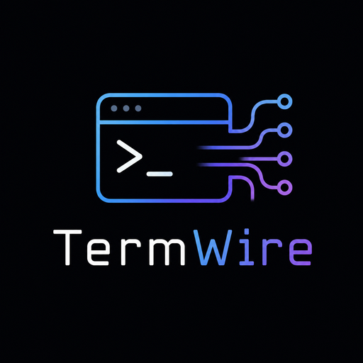

<!-- LOGO -->
<h1>
<p align="center">
  
  <br>TermWire
</h1>
  <p align="center">
    The missing session layer between shells and terminal windows.
    <br />
    A per-user runtime owns every PTY; terminals become views.
    <br />
    <a href="#about">About</a>
    ·
    <a href="https://toppk.github.io/termwire/">Manifesto</a>
    ·
    <a href="https://toppk.github.io/termwire/architecture.html">Architecture</a>
    ·
    <a href="#building">Building</a>
    ·
    <a href="#roadmap-and-status">Roadmap</a>
  </p>
</p>

## About

TermWire is a rethinking of terminal ownership. Today every terminal
emulator owns its PTYs, so closing a window kills the work inside it,
and the desktop has no object that represents "these five terminals
belong to one task." TermWire moves the boundary: a per-user daemon
(`termwired`) owns every PTY, its processes, and — via Ghostty's VT
engine — the canonical screen state; terminal windows, browser tabs,
CLIs, and AI agents become interchangeable clients that attach to
sessions and detach without ending them.

The goal is to become for terminals what PipeWire became for Linux
audio: the runtime layer nobody has to think about. The full argument
— the ZFS layering-violation lesson, the esd → PulseAudio → PipeWire
history, and why tmux is evidence rather than the answer — is in the
[manifesto](https://toppk.github.io/termwire/). The default experience
must stay indistinguishable from a traditional terminal: shells, vim,
htop, ssh, and every curses application keep working unchanged.

## Documentation

- [Manifesto](https://toppk.github.io/termwire/) — why terminal
  ownership needs to move.
- [Architecture](https://toppk.github.io/termwire/architecture.html) —
  the runtime, both wire protocols, and current limitations.
- [TermWire-Vision.md](TermWire-Vision.md) — the original vision notes.

Documentation source lives in [docs/](docs/) and is deployed to GitHub
Pages by [a workflow](.github/workflows/pages.yml).

## Building

Requires **Zig 0.16.0** (exactly — see
[Vendored dependencies](#vendored-dependencies)) and git submodules:

```shell-session
git submodule update --init --depth 1
zig build
zig build test
```

Try it:

```shell-session
zig-out/bin/termwired      # terminal 1: run the daemon
zig-out/bin/tw new         # terminal 2: create a session and attach
                           #   ... work, then Ctrl-\ to detach ...
zig-out/bin/tw ls          # sessions survive their windows
zig-out/bin/tw attach 1    # pick up exactly where you left off
```

## Roadmap and Status

TermWire is early bring-up: the foundation runs, nothing is stable yet.

The high-level plan for the project, in order:

|  #  | Step                                                     | Status |
| :-: | -------------------------------------------------------- | :----: |
|  1  | Session runtime owning PTYs, control + data planes       |   ✅   |
|  2  | CLI client (`tw`) with detach/reattach                   |   ✅   |
|  3  | Ghostty's VT engine (`libghostty-vt`) linked as terminal core | ✅ |
|  4  | Browser client (WebSocket + vendored xterm.js)           |   ❌   |
|  5  | Runtime-owned scrollback and replay on attach            |   ❌   |
|  6  | Workspace model, read-only observers, controller leases  |   ❌   |
|  7  | Native desktop client, mobile, collaboration             |   ❌   |
|  8  | AI agents as first-class, user-approved participants     |   ❌   |

Additional details for each step:

#### Session Runtime

`termwired` is a per-user daemon: a single-threaded poll loop that
owns every session's PTY and child process. The control plane is
newline-delimited JSON over a Unix socket (`create_session`,
`list_sessions`, `kill_session`); the data plane is one socket per
session carrying framed input (data/resize) in and raw PTY bytes out.
Management never tunnels through the terminal byte stream.

#### CLI Client

`tw new` creates a session sized like your terminal and attaches;
`Ctrl-\` detaches while the session keeps running; `tw ls`,
`tw attach <id>`, and `tw kill <id>` do what they say. Attach puts
the local terminal in raw mode and propagates resizes, so vim and
htop behave exactly as they would in a plain terminal.

#### Terminal Core

The daemon consumes Ghostty's terminal emulation as the `ghostty-vt`
Zig module (libghostty-vt), imported directly from the vendored tree —
a production-grade VT engine rather than a reimplementation. The
wiring is proven in tests today; runtime-owned screen state and
scrollback (step 5) build on it.

## Vendored dependencies

- `third_party/ghostty` — provides the `ghostty-vt` Zig module. Pinned
  to a commit on `main`, not a release tag: the newest release requires
  Zig 0.15.2 while `main` requires 0.16.0, and matching the system Zig
  won. Re-pin to a release tag once v1.3.2+ ships. Zig build-system
  APIs break between minor versions, so the Ghostty pin and the Zig
  version move together.
- `third_party/xterm.js` — pinned to release tag `6.0.0`, for the
  browser client in `web/`.

## Repository layout

```
daemon/       termwired — the per-user session runtime
protocol/     wire-format types shared by daemon and clients
cli/          tw — CLI client (new/ls/attach/kill)
web/          browser client (xterm.js) — next milestone
docs/         documentation site (GitHub Pages)
third_party/  vendored dependencies (git submodules)
```

## License

[MIT](LICENSE), like the Ghostty engine this project builds on.
